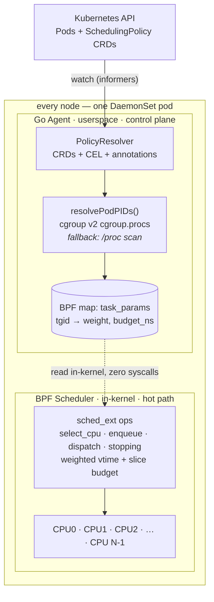

<div align="center">

# k8s-sched

**Kubernetes-native CPU scheduler powered by sched_ext + eBPF**

*Give latency-critical pods kernel-level CPU priority. No kernel patches, no custom kernels, no sidecars.*

[](https://github.com/Fengrru/k8s-sched/actions/workflows/ci.yml)


</div>

---

## What is this?

k8s-sched turns Pod annotations into **in-kernel CPU scheduling decisions**. A DaemonSet agent per node watches Pods, resolves them to host processes via cgroup v2, and writes `{weight, budget}` into a BPF map. An eBPF scheduler (`CONFIG_SCHED_CLASS_EXT=y`, Linux 6.12+) reads these maps and implements **weighted virtual-time dispatch with per-slice budget caps** — all inside the kernel, with no userspace round-trip on the hot path.

| Annotation | Effect |
|---|---|
| `scheduling.fengrru.dev/importance=95` | This Pod gets ~10x more CPU time than default |
| `scheduling.fengrru.dev/importance=10` | This Pod gets ~1/10th CPU time, yields to others |
| `scheduling.fengrru.dev/budget-microseconds=2000` | Slice capped at 2ms (default 5ms) → tighter preemption, lower tail latency |

**For users:** add one annotation to your Deployment. The scheduler does the rest.

**For platform teams:** deploy one Helm chart. All nodes get the DaemonSet. No kernel recompile, no hypervisor, no sidecar injection — just `CONFIG_SCHED_CLASS_EXT=y` in your kernel.

> 🔬 **Every commit is verified on a real sched_ext kernel.** CI boots a Linux 6.14 microVM (via [virtme-ng](https://github.com/arighi/virtme-ng)), compiles the BPF scheduler against its BTF, attaches it as the live scheduler, and asserts that scheduling actually happens — see the [`bpf-verify` job](.github/workflows/ci.yml).

## Why?

Kubernetes has `PriorityClass` for pod scheduling (deciding _which node_ to place a pod on). It has `requests/limits` for resource allocation. What it lacks is a way to say:

> "When this payment-processing pod and this batch-analytics pod are both running on the same node, I want the payment pod to get CPU cycles _first_, every time, without preempting or killing the batch pod."

This is the gap between **placement** and **runtime**. `k8s-sched` closes it.

### vs. existing approaches

| Approach | What it does | Limitation |
|---|---|---|
| `PriorityClass` | Schedules pods onto nodes | No runtime effect after placement |
| CPU `limits` | Caps CPU consumption | Throttling, not prioritization |
| cgroup `cpu.weight` | Per-pod proportional CPU sharing | Coupled to `requests`; hierarchical dilution; no slice control |
| Koordinator Group Identity | CPU QoS tiers | Requires a vendor-patched kernel |
| **k8s-sched** | **Explicit per-pod weight + slice budget on a mainline kernel** | Alpha; single flat scheduling pool |

**"Isn't this just `cpu.weight`?"** — fair question, answered honestly in the [FAQ](#faq).

## What happens when it breaks?

Anything that touches the kernel scheduler must answer this first:

| Failure | Behavior |
|---|---|
| BPF scheduler misbehaves (stall, runaway) | Kernel **watchdog auto-ejects it** and falls back to EEVDF within seconds — the node keeps running |
| Agent crashes / is OOM-killed | struct_ops link closes → kernel **instantly reverts** to the default scheduler |
| Kernel lacks sched_ext | Agent starts in **observe-only mode**: watches pods, exports metrics, schedules nothing |
| Human wants out *now* | `helm uninstall`, or `sysrq-S` to kick out any sched_ext scheduler from the console |

This is the core sched_ext safety contract: a buggy BPF scheduler can degrade scheduling for a few seconds — it cannot panic or wedge the kernel.

## Architecture



### Scheduling algorithm

```
On stopping (task leaves CPU, charged by actual usage):
  vtime += (used_ns × 10000) / weight

  weight=10000 → charged 0.5ms per 5ms used → runs ~10x more
  weight=1000  → charged 5ms (default, 1:1)
  weight=100   → charged 50ms → runs ~1/10th

On enqueue (wakeup fairness clamp):
  vtime = max(vtime, vtime_now - DEFAULT_SLICE)
  → sleepers can't hoard credit and starve runners

Budget enforcement: slice = min(DEFAULT_SLICE, budget_ns)
  budget=2ms → task is preempted after at most 2ms per slice
```

Params are keyed by **tgid** (thread-group id), so every thread of a multi-threaded process inherits its Pod's weight and budget.

## Quick Start

```bash
# 1. Check kernel support (need 6.12+, CONFIG_SCHED_CLASS_EXT=y)
zgrep CONFIG_SCHED_CLASS_EXT /proc/config.gz

# 2. Install CRD + scheduler
kubectl apply -f config/crd/bases/scheduling.fengrru.dev_schedulingpolicies.yaml
helm install k8s-sched ./chart/k8s-sched \
  --namespace kube-system \
  --set image.repository=ghcr.io/fengrru/k8s-sched

# 3. Annotate your pods
kubectl annotate pod payment-api-7d4f8b9c-x2k3m \
  scheduling.fengrru.dev/importance=95

# 4. Verify it took over (on the node)
cat /sys/kernel/sched_ext/root/ops        # → k8s_sched
kubectl -n kube-system logs ds/k8s-sched | grep "scheduler loaded"
curl -s localhost:9090/metrics | grep k8s_sched_enqueues_total

# 5. Bail out any time — kernel reverts to EEVDF instantly
helm uninstall k8s-sched -n kube-system
```

## CRD: SchedulingPolicy

```yaml
apiVersion: scheduling.fengrru.dev/v1alpha1
kind: SchedulingPolicy
metadata:
  name: latency-critical
spec:
  podSelector:
    matchLabels:
      app: payment-api
  weight: 9000             # 1-10000, higher = more CPU
  budgetMicroseconds: 2000 # 0 = unlimited; caps the 5ms default slice
```

| Field | Type | Default | Description |
|---|---|---|---|
| `podSelector` | LabelSelector | `{}` | Pods to apply this policy to |
| `weight` | int | 1000 | Scheduling weight (1–10000) |
| `budgetMicroseconds` | int | 0 | Max CPU per slice; 0 = no cap. Only values below the 5ms default slice have an effect |

## Pod Annotations

| Annotation | Values | Equivalent |
|---|---|---|
| `scheduling.fengrru.dev/importance` | 1–100 | `weight = importance × 100` |
| `scheduling.fengrru.dev/weight` | 1–10000 | Direct weight override |
| `scheduling.fengrru.dev/budget-microseconds` | µs | `budgetMicroseconds` |

`weight` overrides `importance` if both are set.

## Observability

The agent exposes Prometheus metrics on `:9090/metrics`, plus `/healthz` and `/readyz`:

| Metric | Type | Meaning |
|---|---|---|
| `k8s_sched_enqueues_total` | counter | Task enqueues seen by the in-kernel scheduler (liveness of the hot path) |
| `k8s_sched_budget_capped_total` | counter | Enqueues where a budget shortened the slice (is your budget actually biting?) |
| `k8s_sched_params_mapped` | gauge | Pods with parameters currently written to the BPF map |
| `k8s_sched_active_policies` | gauge | SchedulingPolicy CRDs currently active |

Rule of thumb: `enqueues_total` flat-lining while pods run means the scheduler isn't attached; `params_mapped` at 0 with annotated pods means PID resolution is failing (check `hostPID` and cgroup mounts).

## FAQ

**How is this different from cgroup `cpu.weight`? Kubernetes already sets that from `requests`.**
Four things, honestly ranked:
1. **Slice budget** — `cpu.weight` divides CPU *bandwidth* but never shortens a *slice*. The budget cap bounds how long any competing task runs before a latency-critical task can get back on-CPU. There is no cgroup equivalent.
2. **Intent decoupled from capacity** — with `cpu.weight` your priority is welded to `requests`. Raising priority means lying about capacity, which distorts bin-packing. Here, weight is an explicit, orthogonal signal.
3. **Flat node-level pool** — cgroup weights dilute through the hierarchy (`kubepods.slice` → QoS class → pod). k8s-sched compares all participating tasks in one vtime pool, so `9000 vs 200` means exactly 45:1 on that node.
4. **Programmability** — this is a software scheduler: strict-priority tiers, deadline hints, or per-LLC placement are BPF patches, not kernel forks.

Whether these matter for *your* workload is an empirical question — see the [benchmark methodology](docs/benchmark.md). If `cpu.weight` covers your needs, use `cpu.weight`.

**vs. Koordinator / Alibaba Group Identity?**
Similar goal (CPU QoS tiers), different trade-off: Group Identity needs a vendor-patched kernel (Alibaba Cloud Linux). k8s-sched runs on any mainline 6.12+ kernel.

**Why key by tgid instead of pid?**
The kernel's `p->pid` is a *thread* id. Keying by `p->tgid` means all threads of a process — and therefore all processes listed in the pod's `cgroup.procs` — inherit the pod's parameters. Verify on a live node: `bpftool map dump pinned /sys/fs/bpf/k8s-sched/task_params`.

**Can a low-weight pod starve?**
No. The wakeup clamp (`vtime = max(vtime, vtime_now - slice)`) bounds how far behind any task can fall; everything eventually runs. Weight shifts proportions, it doesn't gate execution.

## Performance

By design the hot path (enqueue/dispatch) runs entirely in-kernel with zero userspace round-trips; userspace is only involved on pod add/update/delete.

Quantified claims need data: a reproducible three-arm benchmark (bare EEVDF vs `cpu.weight` vs k8s-sched, schbench + stress-ng) is specified in [docs/benchmark.md](docs/benchmark.md). **Results will be published here once run on dedicated hardware** — shared-runner numbers are noise and won't be posted.

## Requirements

| Component | Minimum |
|---|---|
| Linux kernel | 6.12+ with `CONFIG_SCHED_CLASS_EXT=y` |
| Kubernetes | 1.28+ |
| Node capabilities | `BPF`, `SYS_ADMIN`, `PERFMON` |
| DaemonSet | `hostPID: true`, `privileged: true` |
| BPF toolchain | `clang >= 16`, `libbpf >= 1.2` (build only) |

## Development

```bash
# Prerequisites
apt install clang bpftool golang-go

# Build
make generate-vmlinux  # vmlinux.h from the running kernel's BTF
make generate-ebpf     # BPF C → .o
make build             # Go binary → bin/agent

# Test
make test              # unit + vtime math (any OS)
make test-smoke        # load+attach+schedule on the current kernel (root, sched_ext)
make vm-smoke          # same, inside a virtme-ng VM — no special host kernel needed

# Docker
docker build -t k8s-sched:latest .
```

`make vm-smoke` mirrors exactly what CI does: boot a sched_ext kernel in QEMU, generate `vmlinux.h` from its BTF, compile the scheduler, attach it, and assert the enqueue counters move ([hack/vm-smoke.sh](hack/vm-smoke.sh)).

### Test coverage

| Package | Covers |
|---|---|
| `internal/maps/` | Annotation parsing, weight/budget extraction, vtime math |
| `internal/cel/` | CEL evaluation, LRU cache, concurrent access |
| `internal/k8s/` | Pod watcher lifecycle, field selector |
| `internal/policy/` | CRD + annotation merge precedence |
| `internal/sched/` | Loader failure paths **+ real-kernel smoke test (CI, every commit)** |

## Limitations

Honest list, alpha software:

- **Single flat scheduling pool** — no cgroup-hierarchy awareness, no NUMA/LLC-aware dispatch yet; best suited to single-socket nodes.
- **Budget caps a slice, it is not a latency guarantee** — a capped task still waits in the vtime queue like everyone else.
- **Global DSQ** — one shared dispatch queue per node; very high core counts will see contention.
- **Stats counters are global** (per-CPU map planned), so the stats hot path has cross-CPU cache-line traffic.
- **Not yet benchmarked against `cpu.weight`** — see [docs/benchmark.md](docs/benchmark.md); claims above are architectural, not yet empirical.

## Roadmap

- [ ] Publish three-arm benchmark results (EEVDF / `cpu.weight` / k8s-sched)
- [ ] Strict-priority tier above the weighted pool
- [ ] Per-CPU stats map
- [ ] `SchedulingPolicy.status` writeback (matched pod counts)
- [ ] NUMA/LLC-aware dispatch queues

## License

Apache 2.0 — see [LICENSE](LICENSE)

## Authors

**fengrru** — [github.com/Fengrru](https://github.com/Fengrru)

---

*Built on [sched_ext](https://github.com/sched-ext/scx) — the extensible BPF scheduler class backed by Meta and Google, mainline since Linux 6.12.*
